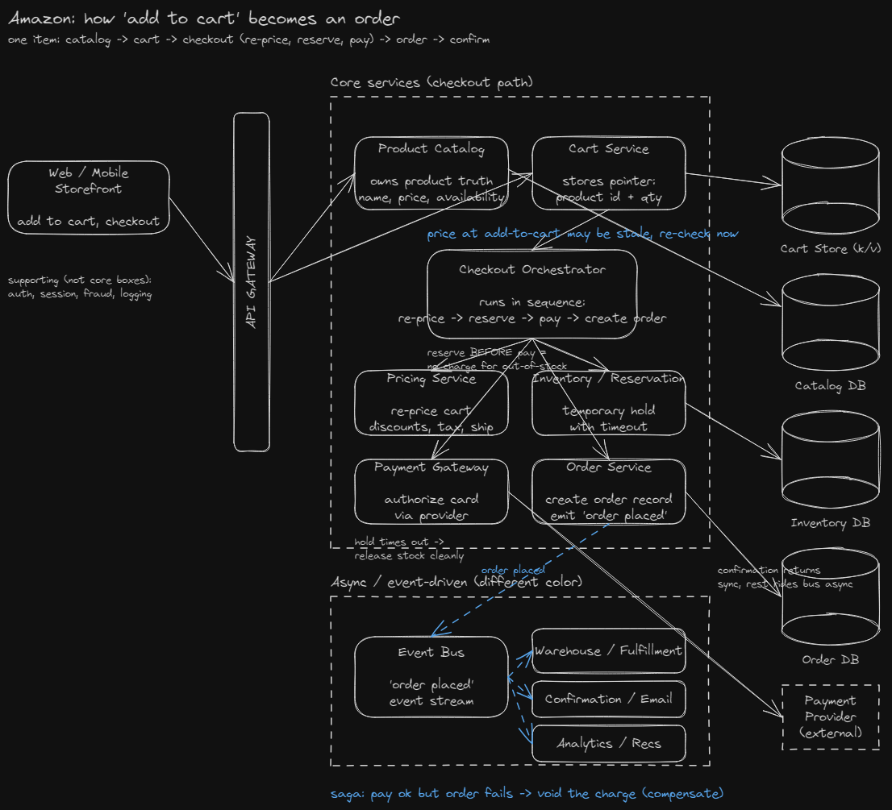

# Day 6 — 21 Aug 2026 — Amazon: How does "Add to Cart" become an order?

**main question:** How does the product move from catalog selection through cart, inventory, payment, and confirmation?

**hld/excalidraw focus (from calendar):** Product catalog, cart store, pricing, inventory reservation, checkout orchestrator, payment gateway, order service, and event bus.

---

## 1. concept explanation

the question: how does one item go from "add to cart" all the way to a confirmed order, through catalog, cart, pricing, inventory, payment, and confirmation, without double-selling stock or charging you for something that's out of stock?

how it actually works: when you tap "add to cart," you're not buying anything yet. the cart service just stores a reference: product id, quantity, and a pointer back to the catalog, in a fast cart store (usually a key-value store keyed by your user or session). the catalog owns the truth about what the product is; the cart only holds a pointer plus quantity, so the price and availability get re-checked later, not frozen at add time. when you hit checkout, a checkout orchestrator takes over and runs the steps in order. first it re-prices the cart (current price, discounts, tax, shipping) because the price at "add to cart" might be stale. then it asks the inventory service to *reserve* the stock, not just check it. a reservation is a temporary hold with a timeout, so two people can't both buy the last unit. only after the hold succeeds does it call the payment gateway to authorize your card. if payment authorizes, the order service creates the order record and the orchestrator emits an "order placed" event onto an event bus. downstream consumers (warehouse, email confirmation, analytics, recommendations) react to that event asynchronously. your confirmation screen comes back the moment the order is created, everything after is background work.

trade-offs worth knowing:
- reserve-then-pay vs pay-then-reserve: reserving stock first avoids charging for out-of-stock items, but a reservation that times out (abandoned checkout) has to release cleanly or you leak inventory
- the checkout orchestrator is a saga: payment succeeds but order-create fails means you must refund/void, so each step needs a compensating action, not just a retry
- sync vs async boundary: the order is confirmed synchronously, but shipping/email/analytics ride the event bus async so a slow warehouse system never blocks the buy button

---

## 2. gemini prompt

```
Build a basic high-level design skeleton for: "how does 'add to cart' become a confirmed order" (amazon-style checkout, one item from cart to confirmation).

Lay it out in five groups, left to right / top to bottom:
1. user surfaces (left): Web/Mobile Storefront
2. API / edge layer (next): API Gateway
3. core services (center): Product Catalog Service, Cart Service, Pricing Service, Checkout Orchestrator, Inventory/Reservation Service, Payment Gateway, Order Service
4. async / event-driven (below core services): Event Bus, Warehouse/Fulfillment Consumer, Confirmation/Email Service, Analytics Consumer
5. data stores / external (right): Cart Store (key-value), Catalog DB, Inventory DB, Order DB, external Payment Provider

Give me:
1. the component list grouped exactly as above
2. the primary synchronous flow as numbered arrows, e.g. "1. Storefront -> API Gateway -> Cart Service (add to cart)" then checkout: re-price -> reserve inventory -> authorize payment -> create order -> return confirmation, all the way through
3. the async flow as a SEPARATE numbered sequence (Order Service emits "order placed" onto the Event Bus, and warehouse + email + analytics consumers react), explicitly marked "async - different color in the diagram"
4. one line per component: what shape to draw it as in Excalidraw and a short label (e.g. "rectangle: Checkout Orchestrator - runs re-price, reserve, pay, create order in sequence" / "cylinder: Cart Store - holds product id + qty per user")
5. a one-line note on what NOT to draw as a core box: auth, logging, session, fraud checks - these go in as small supporting blocks off to the side only

Keep it to ONE item's journey from add-to-cart to order confirmation, not the whole Amazon platform.
```

---

## 3. linkedin post

```
how does "add to cart" actually turn into an order

adding to cart isnt buying. the cart service just stores a pointer, product id, quantity, thats it. no money moves, no stock is held. the price you saw isnt even locked in yet

the real work starts at checkout. a checkout orchestrator runs a strict sequence and the order matters a lot

first it re-prices your cart, because the price at add-to-cart time might be stale. then it reserves inventory, not just checks it. a reservation is a temporary hold with a timeout so two people cant both buy the last unit. only after the hold succeeds does it authorize your card

pay first, reserve later would mean charging you for stuff thats out of stock. reserve first, pay later is why that rarely happens

then the order service writes the order, and fires an "order placed" event onto an event bus. the warehouse, the confirmation email, analytics, recommendations, they all react to that event in the background

thats why your confirmation screen loads instantly. the order is created synchronously, everything after rides the bus async so a slow warehouse system never blocks the buy button

the tricky part nobody sees: payment succeeds but order-create fails. now you have to void the charge. every step needs an undo, not just a retry. its a saga, not a straight line

mapped the whole flow as a proper hld, attached below
```

---

## 4. twitter / x post

```
"add to cart" doesnt buy anything. it just stores a pointer to the product

the real sequence happens at checkout: re-price, then RESERVE stock (a hold with a timeout), then charge your card, then create the order

reserve before pay is why you dont get charged for out of stock items

hld attached
```

---

## HLD diagram


